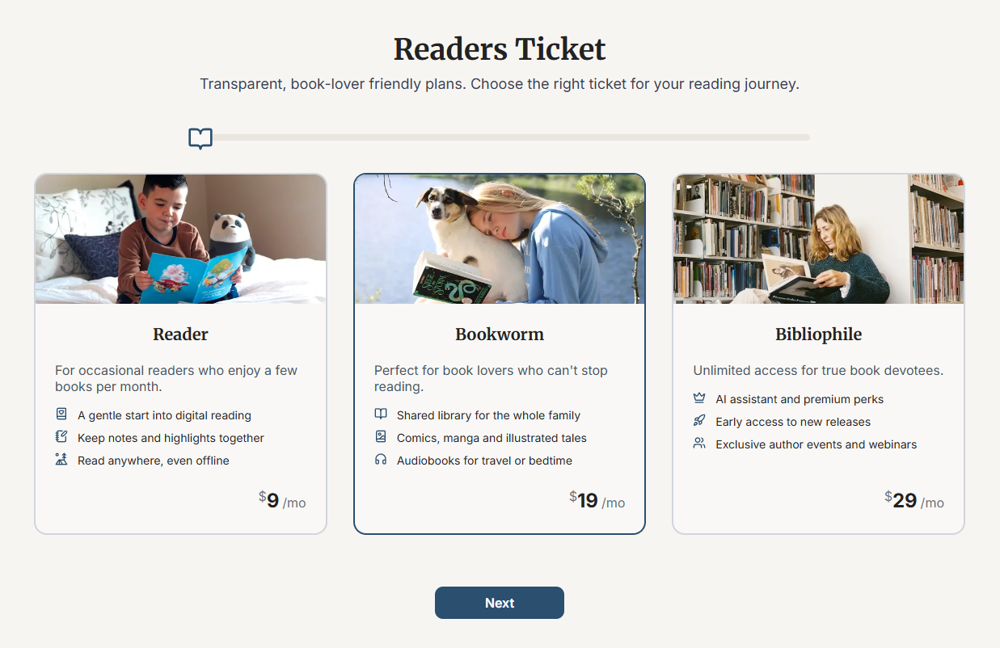
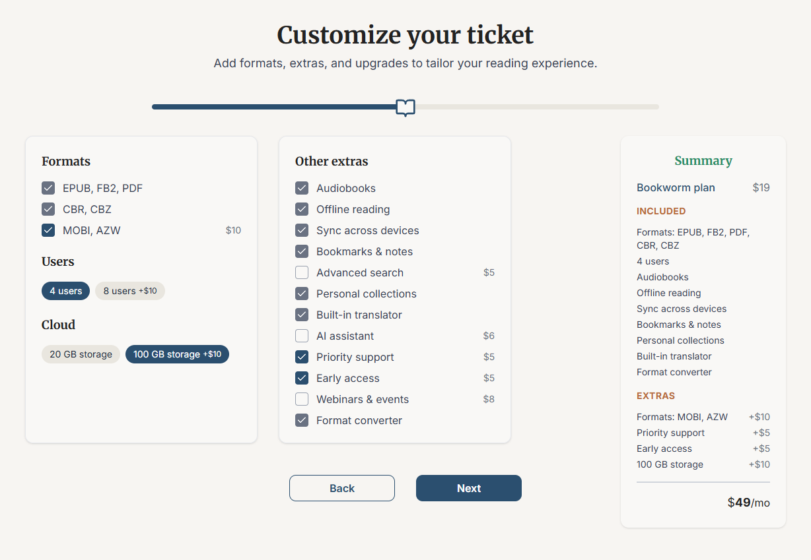
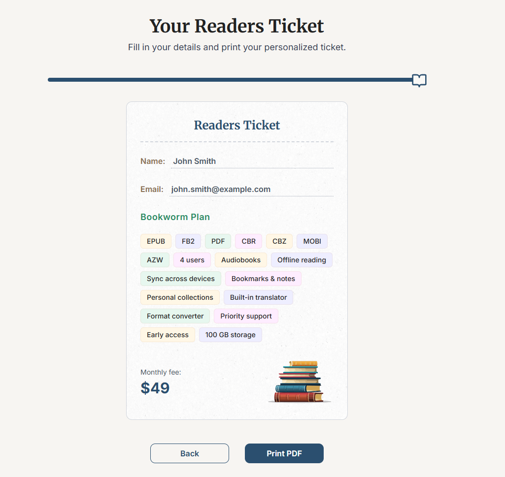

# Readers Ticket

This is an interactive demo app created using **Next.js 15**.
It features an online service subscription calculator wizard.
You can select a plan and additional features before generating a library card PDF after filling out a form.
This project was created to showcase SSR pages, Zustand storage, dynamic navigation between steps, error handling, responsive layout, basic API integration, and configured tests.

---

## Demo

Live demo is available at: TODO_REPLACE

---

## Screenshots





---

## Tech Stack

- **Next.js 15 (App Router)**
- **React 19**
- **TypeScript**
- **Radix UI**
- **Tailwind CSS**
- **Zustand** - client state (fetched data, selected plan, features, etc.)
- **Playwright** - e2e test example
- **Vitest + Testing Library** - unit test example

---

## Installation and usage

```bash
# 1. Clone the repository
git clone https://github.com/TODO_REPLACE/readers-ticket.git
cd readers-ticket

# 2. Install dependencies
npm install

# 3. Create a .env.local file
echo "NEXT_PUBLIC_BASE_URL=http://localhost:3000" > .env.local

# 4. Start the app
npm run dev
```

The application will be available at: http://localhost:3000

---

## Tests

Tests were added for demonstration purposes, to illustrate the basic environment setup:

- Vitest (a unit test for one component)
- Playwright (one end-to-end navigation test)

Run:

```bash
# Unit tests
npm run test

# End-to-end tests
npx playwright install --with-deps
npx playwright test
```

---

## Project structure

```bash
app/
 ├── layout.tsx            # Root layout (SSR)
 ├── (wizard)/layout.tsx   # Main app layout
 ├── (wizard)/plans/       # Step 1: choose plan
 ├── (wizard)/options/     # Step 2: extra options (features)
 ├── (wizard)/ticket/      # Step 3: final ticket
 └── api/                  # Mock API endpoints (plans, features, faq)

components/
 ├── Header.tsx
 ├── Step1Plans.tsx
 ├── Step2Options.tsx
 ├── TicketCard.tsx
 ├── ProgressBar.tsx
 ├── StepNavigation.tsx
 ├── PricingTable.tsx
 ├── FAQ.tsx
 └── Summary.tsx

store/
 └── useReadersStore.ts    # zustand store

e2e/
 └── plans.spec.ts         # e2e test example

components/
 └── Step1Plans.test.tsx   # example unit test

```
